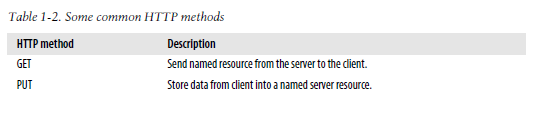

# HTTP - The Definitive Guide

## Part I. HTTP: The Web's Foundation

### 1. Overview of HTTP
### 2. URLs and Resources
### 3. HTTP Messages
### 4. Connection Management

## Part II: HTTP Architecture

### 5. Web Servers
### 6. Proxies
### 7. Caching
### 8. Integration Points: Gateways, Tunnels, and Relays
### 9. Web Robots
### 10. HTTP-NG

## Part III: Identification, Authorization, and Security

### 11. Client Identification and Cookies
### 12. Basic Authentication
### 13. Digest Authentication
### 14. Secure HTTP

## Part IV: Entities, Encodings, and Internationalization

### 15. Entities and Encodings
### 16. Internationalization
### 17. Content Negotiation and Transcoding

## Part V: Content Publishing and Distribution

### 18. Web Hosting
### 19. Publishin Systems
### 20. Redirection and Load Balancing
### 21. Logging and Usage Tracking

---
---

# Part I. HTTP: The Web's Foundation

---

# 1. Overview of HTTP

## Web Clients and Servers

Web content lives on web servers. Web servers speak the HTTP protocol, so they are often called HTTP servers. These HTTP servers store the Internet’s data and provide the data when it is requested by HTTP clients. The clients send HTTP requests to servers, and servers return the requested data in HTTP responses, as sketched in the following figure. Together, HTTP clients and HTTP servers make up the basic components of the World Wide Web.


You probably use HTTP clients every day. The most common client is a web browser, such as Microsoft Internet Explorer or Netscape Navigator. Web browsers request HTTP objects from servers and display the objects on your screen.

When you browse to a page, such as “http://www.oreilly.com/index.html,” your browser sends an HTTP request to the server www.oreilly.com (see Figure 1-1). The server tries to find the desired object (in this case, “/index.html”) and, if successful, sends the object to the client in an HTTP response, along with the type of the object, the length of the object, and other information.

## Resources

Web servers host web resources. A web resource is the source of web content. The simplest kind of web resource is a static file on the web server’s filesystem. These files can contain anything: they might be text files, HTML files, Microsoft Word files, Adobe Acrobat files, JPEG image files, AVI movie files, or any other format you can think of.

However, resources don’t have to be static files. Resources can also be software programs that generate content on demand. These dynamic content resources can generate content based on your identity, on what information you’ve requested, or on the time of day. They can show you a live image from a camera, or let you trade stocks, search real estate databases, or buy gifts from online stores (see Figure 1-2).


In summary, a resource is any kind of content source. A file containing your company’s sales forecast spreadsheet is a resource. A web gateway to scan your local public library’s shelves is a resource. An Internet search engine is a resource.

## Media Types

Because the Internet hosts many thousands of different data types, HTTP carefully tags each object being transported through the Web with a data format label called a MIME type. MIME (Multipurpose Internet Mail Extensions) was originally designed to solve problems encountered in moving messages between different electronic mail systems. MIME worked so well for email that HTTP adopted it to describe and label its own multimedia content.

Web servers attach a MIME type to all HTTP object data (see Figure 1-3). When a web browser gets an object back from a server, it looks at the associated MIME type to see if it knows how to handle the object. Most browsers can handle hundreds of popular object types: displaying image files, parsing and formatting HTML files, playing audio files through the computer’s speakers, or launching external plug-in software to handle special formats.


A MIME type is a textual label, represented as a primary object type and a specific subtype, separated by a slash. For example:

* An HTML-formatted text document would be labeled with type text/html.
* A plain ASCII text document would be labeled with type text/plain.
* A JPEG version of an image would be image/jpeg.
* A GIF-format image would be image/gif.
* An Apple QuickTime movie would be video/quicktime.
* A Microsoft PowerPoint presentation would be application/vnd.ms-powerpoint.

There are hundreds of popular MIME types, and many more experimental or limiteduse

## URIs

Each web server resource has a name, so clients can point out what resources they are interested in. The server resource name is called a uniform resource identifier, or URI. URIs are like the postal addresses of the Internet, uniquely identifying and locating information resources around the world.

Here’s a URI for an image resource on Joe’s Hardware store’s web server:

```
http://www.joes-hardware.com/specials/saw-blade.gif
```

Figure 1-4 shows how the URI specifies the HTTP protocol to access the saw-blade GIF resource on Joe’s store’s server. Given the URI, HTTP can retrieve the object. URIs come in two flavors, called URLs and URNs. Let’s take a peek at each of these types of resource identifiers now.

## URLs

The uniform resource locator (URL) is the most common form of resource identifier. URLs describe the specific location of a resource on a particular server. They tell you exactly how to fetch a resource from a precise, fixed location. Figure 1-4 shows how a URL tells precisely where a resource is located and how to access it. Table 1-1 shows a few examples of URLs.


Most URLs follow a standardized format of three main parts:

* The first part of the URL is called the scheme, and it describes the protocol used to access the resource. This is usually the HTTP protocol (http://).

* The second part gives the server Internet address (e.g., www.joes-hardware.com).

* The rest names a resource on the web server (e.g., /specials/saw-blade.gif ).

Today, almost every URI is a URL.

## URNs

The second flavor of URI is the uniform resource name, or URN. A URN serves as a unique name for a particular piece of content, independent of where the resource currently resides. These location-independent URNs allow resources to move from place to place. URNs also allow resources to be accessed by multiple network access protocols while maintaining the same name.

For example, the following URN might be used to name the Internet standards document “RFC 2141” regardless of where it resides (it may even be copied in several places):

```
urn:ietf:rfc:2141
```

## Transactions

Let’s look in more detail how clients use HTTP to transact with web servers and their resources. An HTTP transaction consists of a request command (sent from client to server), and a response result (sent from the server back to the client). This communication happens with formatted blocks of data called HTTP messages, as illustrated in Figure 1-5.


## Methods

HTTP supports several different request commands, called HTTP methods. Every HTTP request message has a method. The method tells the server what action to perform (fetch a web page, run a gateway program, delete a file, etc.). Table 1-2lists five common HTTP methods.

 

## Status Codes

Every HTTP response message comes back with a status code. The status code is a three-digit numeric code that tells the client if the request succeeded, or if other actions are required. A few common status codes are shown in Table 1-3.


HTTP also sends an explanatory textual “reason phrase” with each numeric status code (see the response message in Figure 1-5). The textual phrase is included only for descriptive purposes; the numeric code is used for all processing.

The following status codes and reason phrases are treated identically by HTTP software:

```
200 OK
200 Document attached
200 Success
200 All’s cool, dude
```

## Web Pages Can Consist of Multiple Objects

An application often issues multiple HTTP transactions to accomplish a task. For example, a web browser issues a cascade of HTTP transactions to fetch and display a graphics-rich web page. The browser performs one transaction to fetch the HTML “skeleton” that describes the page layout, then issues additional HTTP transactions for each embedded image, graphics pane, Java applet, etc. These embedded resources might even reside on different servers, as shown in Figure 1-6. Thus, a “web page” often is a collection of resources, not a single resource.


## Messages

Now let’s take a quick look at the structure of HTTP request and response messages. We’ll study HTTP messages in exquisite detail in Chapter 3.

HTTP messages are simple, line-oriented sequences of characters. Because they are plain text, not binary, they are easy for humans to read and write.* Figure 1-7 shows the HTTP messages for a simple transaction.


HTTP messages sent from web clients to web servers are called request messages. Messages from servers to clients are called response messages. There are no other kinds of HTTP messages. The formats of HTTP request and response messages are very similar.

HTTP messages consist of three parts:

* Start line
    * The first line of the message is the start line, indicating what to do for a request or what happened for a response.
* Header fields
    * Zero or more header fields follow the start line. Each header field consists of a name and a value, separated by a colon (:) for easy parsing. The headers end with a blank line. Adding a header field is as easy as adding another line.
* Body
    * After the blank line is an optional message body containing any kind of data. Request bodies carry data to the web server; response bodies carry data back to the client. Unlike the start lines and headers, which are textual and structured, the body can contain arbitrary binary data (e.g., images, videos, audio tracks, software applications). Of course, the body can also contain text.     ## Simple Message Example

Figure 1-8 shows the HTTP messages that might be sent as part of a simple transaction. The browser requests the resource http://www.joes-hardware.com/tools.html.

In Figure 1-8, the browser sends an HTTP request message. The request has a GET method in the start line, and the local resource is /tools.html. The request indicates it is speaking Version 1.0 of the HTTP protocol. The request message has no body, because no request data is needed to GET a simple document from a server.

The server sends back an HTTP response message. The response contains the HTTP version number (HTTP/1.0), a success status code (200), a descriptive reason phrase (OK), and a block of response header fields, all followed by the response body containing the requested document. The response body length is noted in the Content- Length header, and the document’s MIME type is noted in the Content-Type header.

### Connections

Now that we’ve sketched what HTTP’s messages look like, let’s talk for a moment about how messages move from place to place, across Transmission Control Protocol (TCP) connections.

### TCP/IP

HTTP is an application layer protocol. HTTP doesn’t worry about the nitty-gritty details of network communication; instead, it leaves the details of networking to TCP/IP, the popular reliable Internet transport protocol.


TCP provides:

* Error-free data transportation
* In-order delivery (data will always arrive in the order in which it was sent)
* Unsegmented data stream (can dribble out data in any size at any time)

The Internet itself is based on TCP/IP, a popular layered set of packet-switched network protocols spoken by computers and network devices around the world. TCP/IP hides the peculiarities and foibles of individual networks and hardware, letting computers and networks of any type talk together reliably.

Once a TCP connection is established, messages exchanged between the client and server computers will never be lost, damaged, or received out of order.

In networking terms, the HTTP protocol is layered over TCP. HTTP uses TCP to transport its message data. Likewise, TCP is layered over IP (see Figure 1-9).


## Connections, IP Addresses, and Port Numbers

Before an HTTP client can send a message to a server, it needs to establish a TCP/IP connection between the client and server using Internet protocol (IP) addresses and port numbers.

Setting up a TCP connection is sort of like calling someone at a corporate office. First, you dial the company’s phone number. This gets you to the right organization. Then, you dial the specific extension of the person you’re trying to reach.

In TCP, you need the IP address of the server computer and the TCP port number associated with the specific software program running on the server.

This is all well and good, but how do you get the IP address and port number of the HTTP server in the first place? Why, the URL, of course! We mentioned before that URLs are the addresses for resources, so naturally enough they can provide us with the IP address for the machine that has the resource. Let’s take a look at a few URLs:

```
http://207.200.83.29:80/index.html
http://www.netscape.com:80/index.html
http://www.netscape.com/index.html
```

The first URL has the machine’s IP address, “207.200.83.29”, and port number, “80”.

The second URL doesn’t have a numeric IP address; it has a textual domain name, or hostname (“www.netscape.com”). The hostname is just a human-friendly alias for an IP address. Hostnames can easily be converted into IP addresses through a facility called the Domain Name Service (DNS), so we’re all set here, too. We will talk much more about DNS and URLs in Chapter 2.

The final URL has no port number. When the port number is missing from an HTTP URL, you can assume the default value of port 80.

With the IP address and port number, a client can easily communicate via TCP/IP. Figure 1-10 shows how a browser uses HTTP to display a simple HTML resource that resides on a distant server.

Here are the steps:

a. The browser extracts the server’s hostname from the URL.
b. The browser converts the server’s hostname into the server’s IP address.
c. The browser extracts the port number (if any) from the URL.
d. The browser establishes a TCP connection with the web server.
e. The browser sends an HTTP request message to the server.
f. The server sends an HTTP response back to the browser.
g. The connection is closed, and the browser displays the document.


## Protocol Versions

There are several versions of the HTTP protocol in use today. HTTP applications need to work hard to robustly handle different variations of the HTTP protocol. The versions in use are:

* HTTP/0.9
    * The 1991 prototype version of HTTP is known as HTTP/0.9. This protocol contains many serious design flaws and should be used only to interoperate with legacy clients. HTTP/0.9 supports only the GET method, and it does not support MIME typing of multimedia content, HTTP headers, or version numbers. HTTP/0.9 was originally defined to fetch simple HTML objects. It was soon replaced with HTTP/1.0.
* HTTP/1.0
    * 1.0 was the first version of HTTP that was widely deployed. HTTP/1.0 added version numbers, HTTP headers, additional methods, and multimedia object handling. HTTP/1.0 made it practical to support graphically appealing web pages and interactive forms, which helped promote the wide-scale adoption of the World Wide Web. This specification was never well specified. It represented a collection of best practices in a time of rapid commercial and academic evolution of the protocol.
* HTTP/1.0+
    * Many popular web clients and servers rapidly added features to HTTP in the mid-1990s to meet the demands of a rapidly expanding, commercially successful World Wide Web. Many of these features, including long-lasting “keepalive” connections, virtual hosting support, and proxy connection support, were added to HTTP and became unofficial, de facto standards. This informal, extended version of HTTP is often referred to as HTTP/1.0+.
* HTTP/1.1
    * HTTP/1.1 focused on correcting architectural flaws in the design of HTTP, specifying semantics, introducing significant performance optimizations, and removing mis-features. HTTP/1.1 also included support for the more sophisticated web applications and deployments that were under way in the late 1990s. HTTP/1.1 is the current version of HTTP.

## Architectural Components of the Web

In this overview chapter, we’ve focused on how two web applications (web browsers and web servers) send messages back and forth to implement basic transactions. There are many other web applications that you interact with on the Internet. In this section, we’ll outline several other important applications, including:

* Proxies: HTTP intermediaries that sit between clients and servers
* Caches: HTTP storehouses that keep copies of popular web pages close to clients
* Gateways: Special web servers that connect to other applications
* Tunnels: Special proxies that blindly forward HTTP communications
* Agents: Semi-intelligent web clients that make automated HTTP requests

## Proxies

Let’s start by looking at HTTP proxy servers, important building blocks for web security, application integration, and performance optimization.

As shown in Figure 1-11, a proxy sits between a client and a server, receiving all of the client’s HTTP requests and relaying the requests to the server (perhaps after modifying the requests). These applications act as a proxy for the user, accessing the server on the user’s behalf.


Proxies are often used for security, acting as trusted intermediaries through which all web traffic flows. Proxies can also filter requests and responses; for example, to detect application viruses in corporate downloads or to filter adult content away from elementary-school students. We’ll talk about proxies in detail in Chapter 6.

## Caches

A web cache or caching proxy is a special type of HTTP proxy server that keeps copies of popular documents that pass through the proxy. The next client requesting the same document can be served from the cache’s personal copy (see Figure 1-12).


A client may be able to download a document much more quickly from a nearby cache than from a distant web server. HTTP defines many facilities to make caching more effective and to regulate the freshness and privacy of cached content. We cover caching technology in Chapter 7.

## Gateways

Gateways are special servers that act as intermediaries for other servers. They are often used to convert HTTP traffic to another protocol. A gateway always receives requests as if it was the origin server for the resource. The client may not be aware it is communicating with a gateway.

For example, an HTTP/FTP gateway receives requests for FTP URIs via HTTP requests but fetches the documents using the FTP protocol (see Figure 1-13). The resulting document is packed into an HTTP message and sent to the client. We discuss gateways in Chapter 8.


## Tunnels

Tunnels are HTTP applications that, after setup, blindly relay raw data between two connections. HTTP tunnels are often used to transport non-HTTP data over one or more HTTP connections, without looking at the data.

One popular use of HTTP tunnels is to carry encrypted Secure Sockets Layer (SSL) traffic through an HTTP connection, allowing SSL traffic through corporate firewalls that permit only web traffic. As sketched in Figure 1-14, an HTTP/SSL tunnel receives an HTTP request to establish an outgoing connection to a destination address and port, then proceeds to tunnel the encrypted SSL traffic over the HTTP channel so that it can be blindly relayed to the destination server.

## Agents

User agents (or just agents) are client programs that make HTTP requests on the user’s behalf. Any application that issues web requests is an HTTP agent. So far, we’ve talked about only one kind of HTTP agent: web browsers. But there are many other kinds of user agents.


For example, there are machine-automated user agents that autonomously wander the Web, issuing HTTP transactions and fetching content, without human supervision. These automated agents often have colorful names, such as “spiders” or “web robots” (see Figure 1-15). Spiders wander the Web to build useful archives of web content, such as a search engine’s database or a product catalog for a comparisonshopping robot. See Chapter 9 for more information.

